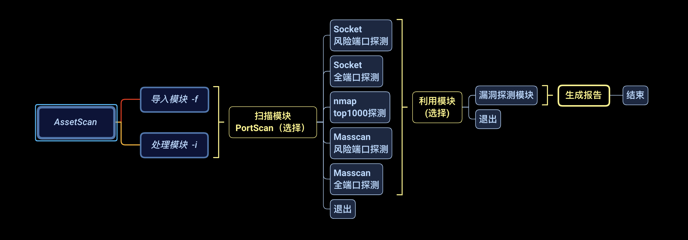
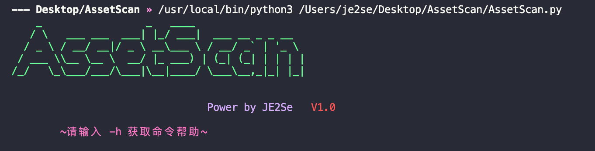
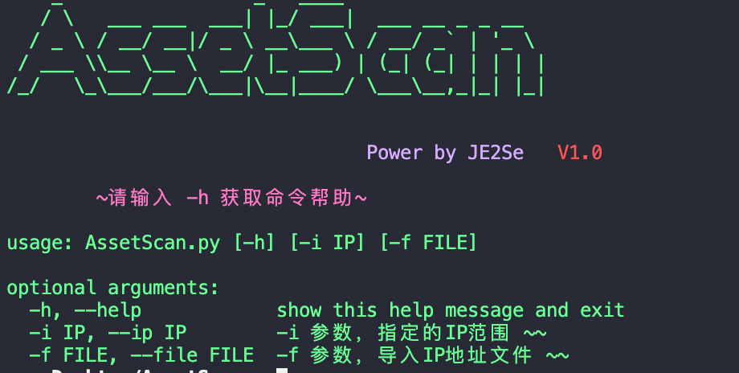
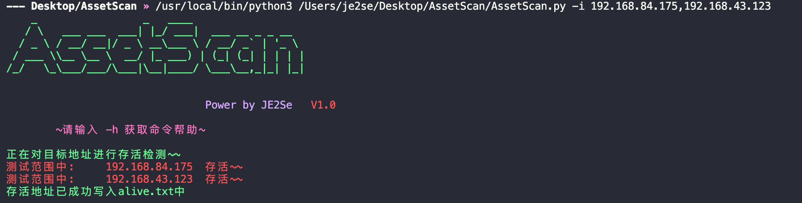
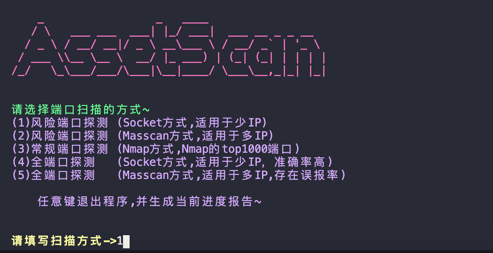
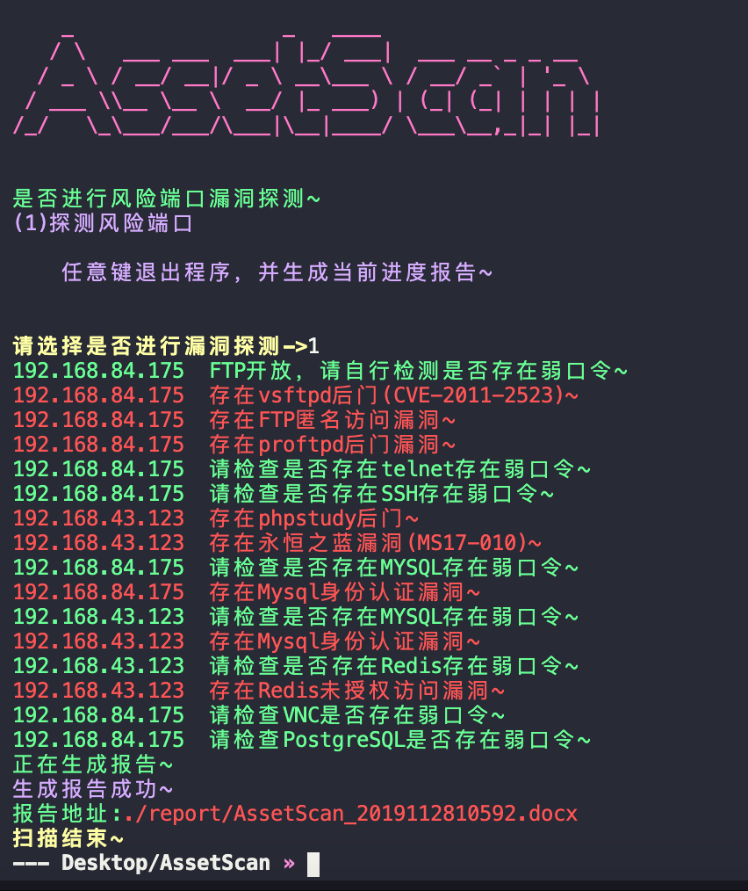
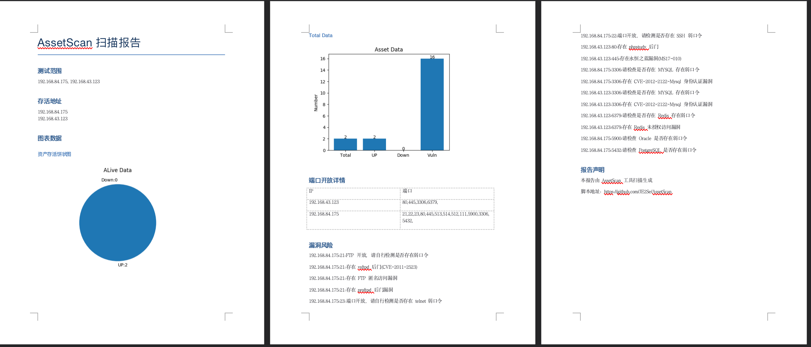

# 欢迎各位大佬提BUG

# 简介

仅个人之见，感觉这两年的红队比较火，不管是在招聘，项目，都在考察攻击人员的内网能力。平时我们在内网中可能会依托一些已知工具进行测试，如nmap去进行一些资产的探测，脆弱面的探测，但是效率非常的慢。如果扫一个网段时间就不敢恭维了。而且，输出的信息只有部分是我们需要的，所以，本工具因此而生。快速的探测内网存活资产，快速分析每个资产的脆弱面，并尝试进行漏洞检测，将存在漏洞的资产，内容进行可视化输出，采用masscan，nmap，socket多种方式对风险端口，常规端口，全端口进行探测。针对内网渗透测试的针对性漏洞，如未授权访问，软件后门，命令执行等关键漏洞进行检测，并对可字典爆破的口令服务进行提醒。

# 说明

脚本使用Python3编写

## 功能介绍

工具支持IP存活检测 
工具支持ARP存活检测 
工具支持IP端口检测，分为三种模式：Masscan，Nmap以及Sock探测的方式，可针对IP的数量，以及性能的预算进行选择使用 
IP端口检测支持全端口检测，Top1000检测，风险端口检测 
工具针对检测出来的风险端口可进行漏洞检测 
工具支持单个IP，多IP，IP段混合输入，同时支持CVS，XLS，TXT文件IP批量导入 
工具提供可视化报告输出，包括具体测试数据，图表等 

#### 框架

## 使用方法

### 安装依赖
<code>python3 -m pip install -r requirements.txt</code> 

**需要在运行系统安装nmap软件** 

### 用法

<code>python3 AssetScan.py -h 获取使用方法 </code>

## 本脚本目前集成了以下漏洞检测poc

21端口-弱口令提醒检测，后门检测，匿名登录检测 22端口-弱口令提醒检测 23端口-弱口令提醒检测 80端口-http.sys漏洞检测，PHPStudy后门检测，IIS短文件名漏洞 110端口-弱口令提醒检测 143端口-MAP弱口令检测 389端口-匿名访问漏洞 443端口-心脏滴血检测，PHPStudy后门检测 445端口-永恒之蓝，08067检测 873端口-Rsync未授权检测 995端口-MAP弱口令检测 1433端口-弱口令提醒检测 2049端口-NFS未授权访问漏洞提醒 2181端口-zookeeper未授权访问漏洞检测 3306端口-弱口令提醒检测，cve2012-2122认证绕过检测 3389端口-MS12-020漏洞，CVE-2019-0708提醒 4848端口-GlassFish未授权访问漏洞检测 5432端口-PostgreSQL弱口令检测提醒 5900端口-VNC弱口令检测提醒 5984端口-CouchDB命令执行漏洞提醒 6379端口-未授权检测漏洞,弱口令提醒检测 7001端口-weblogic反序列化漏洞 8080端口-IIS短文件名漏洞 9200端口-ES目录遍历漏洞，CVE-2014-3120，CVE-2015-1427远程命令执行，未授权访问漏洞 11211端口-未授权访问漏洞 27017端口-弱口令提醒检测，未授权访问漏洞 50030端口-Hadoop未授权访问漏洞检测提醒 

## 扩展性

可自行进行扩充，在主文件AssetScan.py第99行追加检测函数进行导入执行函数。 
在vuln目录最佳检测poc，需return出一个列表，在__init__做引用 

## 说明

脚本内weblogic poc使用了其他大佬现成的检测脚本 
weblogic利用，大佬们写的非常好，向大佬学习 
引用地址：https://github.com/rabbitmask/WeblogicScan 

## 问题

因为环境问题，部分漏洞没有验证没时间弄，漏洞也只有少量，后期追加更新 
测试环境有限，平台之间的兼容性可能存在问题  

## 周期
初版：2019年11月28日   V1.0初版编写完成 
修改1：2019年12月02日  感谢Shadow·J反馈kali下文件导入异常
修改2：2019年12月03日  V1.1发布，新增ARP存活检测

V1.0 原版发布
V1.1 新增ARP存活检测

## 详细说明

### 介绍说明

由于基于unix开发，所以关于字体颜色上，只有unix的系统有皮肤，windows暂时无皮肤

#### 软件初始界面

#### 支持方式

支持 -i 单个IP（192.168.1.1），多个ip（192.168.1.1，192.168.1.2），段IP（192.168.1.1-192.168.2.1）

#### 演示说明

演示环境为win08（192.168.43.123），metasploitable2（192.168.84.175）进行演示

运行后会检测存活

选择扫描的形式，本次选择为（1），

探测结束，选择是否探测风险端口

针对测试出的风险端口进行漏洞探测，对于口令方面的漏洞只设置提醒，其他漏洞提供了检测

输出可视化报告

